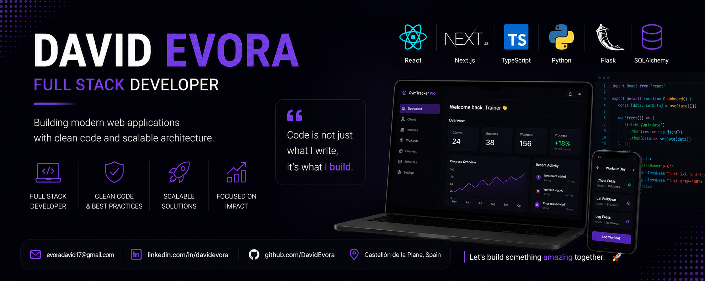

  

# 👋 Hi, I'm David Evora

Full Stack Developer

React • Next.js • TypeScript • Flask • SQLAlchemy

Building scalable web applications and continuously learning new technologies.

### About Me

Full Stack Developer based in Castellón de la Plana, Spain.

Passionate about Full Stack Development.

Recently completed the Full Stack Bootcamp at 4Geeks Academy.

Looking for my first opportunity as a Full Stack Developer.

### Tech Stack

#### Frontend

     

#### Backend

     

#### Database

#### Tools & Others

### Featured Projects

### 🏋️ GymTracker Pro

A full-stack fitness management platform for trainers and clients.

#### ✨ Features

• 🔐 JWT Authentication

• 👥 Trainer & Client Dashboards

• 📋 Routine Management

• 💪 Exercise Library

• 📈 Workout & Body Progress Tracking

• 📱 Responsive UI

#### 🛠️ Tech Stack

React • Next.js • TypeScript • Flask • SQLAlchemy • SQLite • Tailwind CSS • Render • Vercel

### Currently Learning

🐳 Docker

☁️ AWS

🐘 PostgreSQL

### Contact Me

---

🔥 *Open to work — let’s build something great together*

